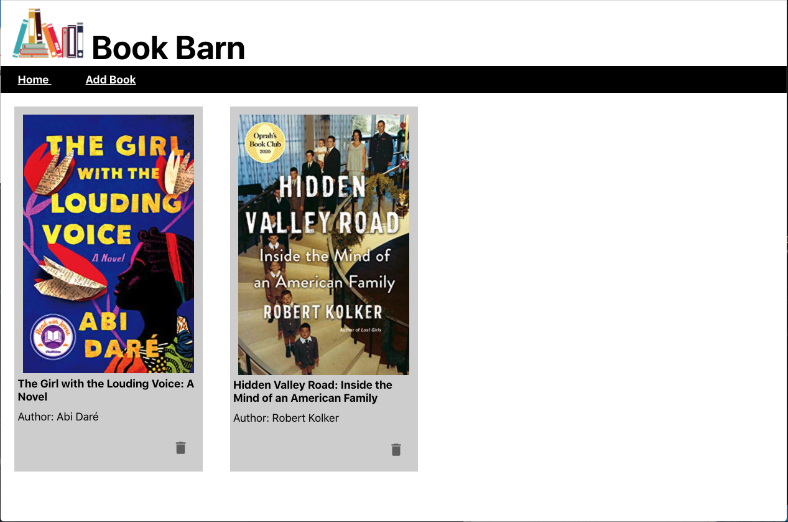
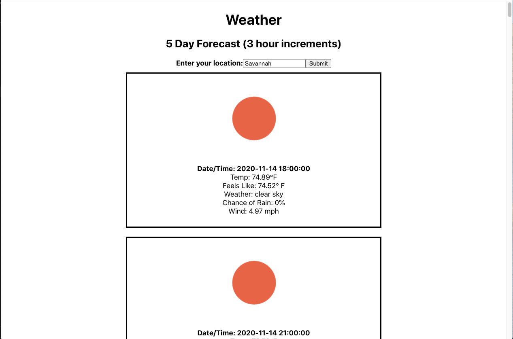
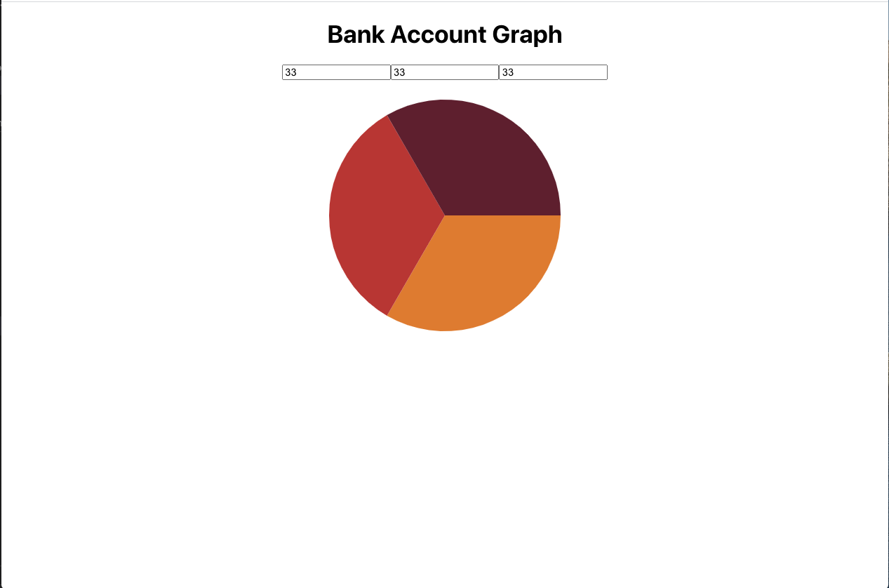
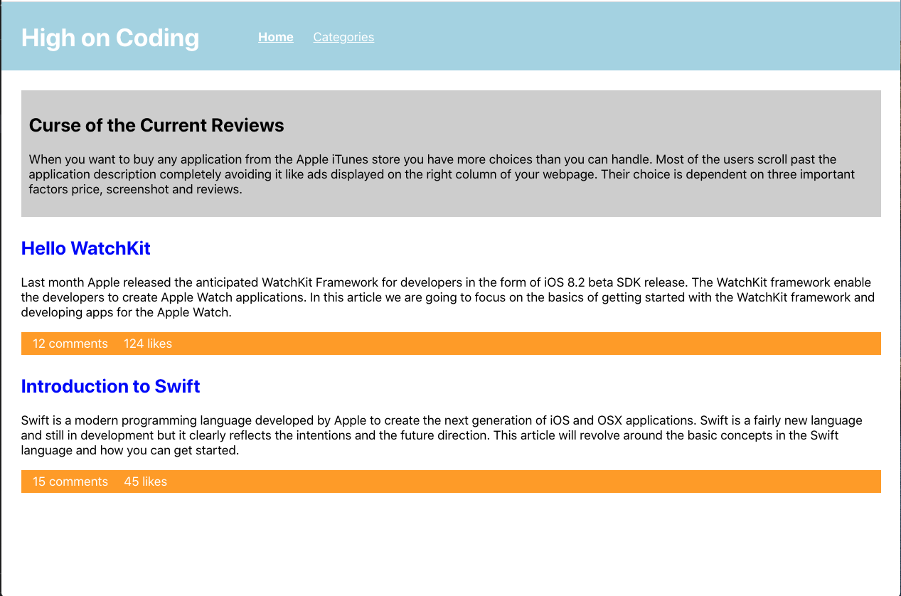

# DigitalCrafts Full-Stack Immersive: React
Coursework on React. This repository contains assignments and activities from DigitalCrafts Week 10

## Summary of Work

### Book Barn App
Prompt was to create an app using Node and React which allows you to register for an account, log in, add books (title, author, genre, year, and cover art) to your library, view, update and delete books. - [Visit Book Barn](https://github.com/kjdonoghue/DC-React/tree/master/book-barn-app)

### Weather API
Prompt was to fetch an API and display the contents on the screen. This weather app asks the user to enter their city into a textbox and then it will pull and display the five day forecast (listed in 3 hour increments) for their location using the Open Weather Map API. - [Visit Weather API](https://github.com/kjdonoghue/DC-React/tree/master/weather-api)

### Bank Account
Prompt was to create an app using React and React Minimal Pie Chart which allows the user to enter ercentages for checking, saving and brokerage accounts which show on a pie chart. Information should be shared between sibling components (Budget & Chart) to display on the main page (App). - [Visit Bank Account](https://github.com/kjdonoghue/DC-React/tree/master/bank-account)

### High on Coding
Prompt was to create the home page of the High on Coding Website using React - [Visit High on Coding](https://github.com/kjdonoghue/DC-React/tree/master/high-on-coding)

### Counter App
Daily exercises include creating an app that counts clicks to a button, two versions of an app that allow the user to increment and decrement the value of a counter when the "+" or "-" buttons are clicked - one using classes and one using hooks, and an app that fetches and displays news articles from an API - [Visit Counter App](https://github.com/kjdonoghue/DC-React/tree/master/counter-app)